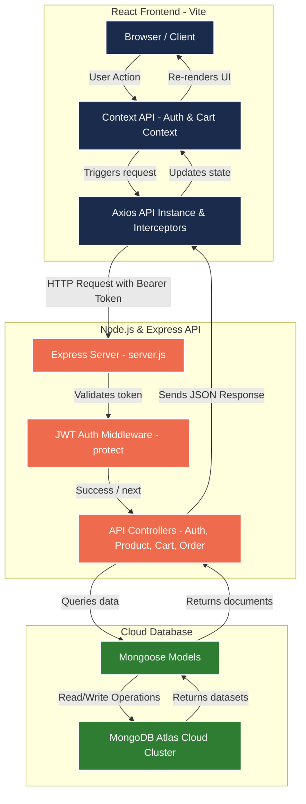

# 🏛️ Solution Architecture - ShopEZ

This document outlines the system architecture and data flow for the ShopEZ E-Commerce Application. 

Because GitHub does not natively render Microsoft Word (`.docx`) or large binary PDF files inside the browser preview, this Markdown file serves as a live, interactive reference that GitHub renders directly.

---

## 🗺️ System Architecture Diagram

The diagram below shows the 3-tier MERN stack architecture, displaying how the Client, API Server, and Cloud Database interact with JWT Authentication middleware.

---

## 🔑 Core Architectural Layers

### 1. Presentation Layer (Frontend Client)
- **Vite & React:** Serves the responsive, static user interface.
- **Context API (`AuthContext`, `CartContext`):** Manages global state states, keeping authentication tokens and shopping cart tallies persistent.
- **Axios Request Interceptor:** Dynamically reads the JSON Web Token (JWT) from `localStorage` and appends it to the `Authorization` header of all outgoing request payloads automatically.

### 2. Application Layer (Backend Server)
- **Express.js Router:** Directs incoming `/api/*` endpoints to the matching controller functions.
- **JWT Verification Guard (`protect` middleware):** Decrypts and verifies the signature of authorization headers before granting access to user profile, checkout, or cart sync routes.
- **Admin Guard (`adminOnly` middleware):** Restricts inventory mutation operations (POST/PUT/DELETE) and dashboard stats endpoints to admin accounts.

### 3. Data Layer (Database)
- **MongoDB Atlas:** A secure, cloud-hosted NoSQL cluster that stores user profiles, product catalogs, order records, and shopping carts.
- **Mongoose ODM:** Defines schemas, indexes fields for quick lookups, and automatically runs `bcryptjs` encryption hooks during password creation.
